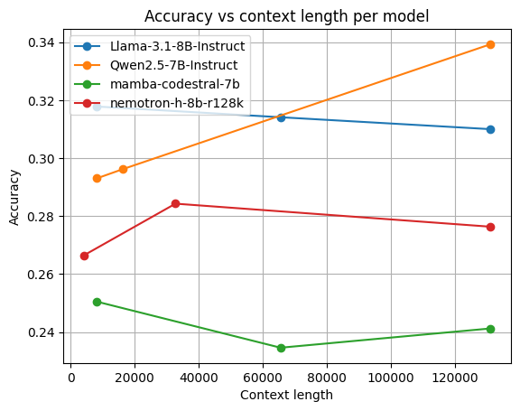
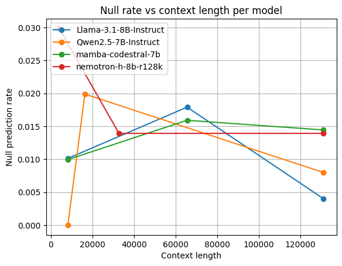

# HPML Project: An Analysis of Long-Context Scaling With State Space Machines

## Team Information
- **Team Name**: Team DAY
- **Members**:
  - Andrew Li (ayl2159)
  - David Zhang (dwz2107)
  - Yuqi Zhang (yz5072)

---
## 1. Problem Statement
Evaluate long-context language models and state space models (SSMs) on LongBench-v2, Ada-LEval, and PG-19, focusing on quality and efficiency across large context lengths (up to 131k+ for Transformers and 32k for SSM baselines).

---
## 2. Model Description
- Architectures: Transformer LLMs (Llama-3.1-8B-Instruct, Qwen2.5-7B-Instruct, Jamba-3B, Nemotron-h-8b-r128k) and SSMs (Mamba-2.8B, Mamba-Codestral-7B).
- Frameworks: PyTorch with vLLM 0.11.2; \`mamba-ssm\` for SSM kernels.
- Customization: Context-length scaling via per-model JSON configs; shared greedy decoding (\`temperature=0.1\`, \`max_new_tokens=256\`, batch_size=16 for efficient serving); note Qwen-7B requires YARN rope-scaling adjustment for largest contexts.

---
## 3. Final Results Summary

### Key Findings

We evaluated four representative models across increasing context lengths (8k to 131k tokens):

**Accuracy Scaling with Context Length**

Among evaluated models, **Qwen2.5-7B-Instruct** demonstrates the strongest positive scaling behavior, with accuracy steadily increasing as context length grows—indicating effective use of additional context. **Llama-3.1-8B-Instruct** maintains relatively stable accuracy with slight degradation at the longest context lengths. Both **mamba-codestral-7B** and **nemotron-h-8b-r128k** underperform Transformers in absolute accuracy. The pure SSM model shows the lowest accuracy overall with limited improvement from extended context, suggesting architectural limitations in long-context reasoning. The hybrid Nemotron model achieves intermediate accuracy with a modest peak at mid-range contexts.

**Null Rate and Output Stability**

Null prediction rates (indicating unparseable or non-compliant outputs) generally increase with context length. Transformer models maintain relatively controlled null rates, with Qwen2.5-7B showing particularly low rates overall. In contrast, SSM-based and hybrid models exhibit consistently higher null rates across all context lengths, with rates increasing further as context grows. This indicates that a significant fraction of errors in smaller SSM/hybrid models stem from output-format and instruction-following failures rather than purely incorrect reasoning.

| Metric | Value |
|----------------------|-------------|
| Models Evaluated | Llama-3.1-8B, Qwen2.5-7B, Mamba-Codestral-7B, Nemotron-8B |
| Context Range | 8k–131k tokens |
| Best Performer (Accuracy) | Qwen2.5-7B-Instruct (34% @ 131k ctx) |
| Benchmark | LongBench-v2 |
| Device | NVIDIA A6000 (48 GB VRAM) |

Refer to JSONL logs in \`results/\` and \`pure_ssm/outputs/pure_ssm_logs/\` for detailed run-level metrics.

---
## 4. Reproducibility Instructions
### A. Requirements
Clone and install:
\`\`\`bash
git clone https://github.com/andli28/SSM_experiment
cd SSM_experiment
pip install -r requirements.txt
\`\`\`

### B. Wandb Dashboard
View training and evaluation metrics here: https://api.wandb.ai/links/davidwz2003-columbia-university/57zty5qi

### C. Specify for Training or For Inference or if Both
This repo focuses on inference/evaluation sweeps. For a single model/context run:
\`\`\`bash
python scripts/pred_one.py --model_cfg configs/models/<model>.json --ctx <max_context_length>
\`\`\`

To sweep all models at configured context lengths:
\`\`\`bash
python scripts/run_grid.py
\`\`\`
Set the context lengths required in \`configs/global.json\`. Will run all models under \`configs/models/\` at the specified context lengths.

**Note:** For Qwen-7B, the rope scaling factor must be adjusted for the largest context being run.

### D. Evaluation
Transformer results are stored under \`results/*.jsonl\`. For SSM baselines (8k/16k/32k) run the Colab-style pipeline:
\`\`\`bash
# Open and run all cells in:
pure_ssm/notebooks/ssm_8k_16k_32k_final.ipynb
\`\`\`
Logs land in Google Drive \`pure_ssm_logs/\` and summaries in \`pure_ssm/results/\`.

If you want to log results automatically, enable wandb in the global config. Otherwise results and more details can be viewed through \`results/view.ipynb\`.

### E. Quickstart: Minimum Reproducible Result
To reproduce a transformer sweep (example):
\`\`\`bash
# 1) Install dependencies
pip install -r requirements.txt

# 2) Configure contexts in configs/global.json
python - <<'PY'
import json
path = 'configs/global.json'
cfg = json.load(open(path))
cfg['ctx'] = [65536, 131072]
json.dump(cfg, open(path, 'w'), indent=2)
PY

# 3) Run sweep
python scripts/run_grid.py

# 4) Inspect outputs
ls results/
\`\`\`

To reproduce a pure SSM 8k/16k/32k run (Colab):
\`\`\`bash
# 1) Clone into Drive (in Colab)
git clone https://github.com/andli28/SSM_experiment /content/drive/MyDrive/SSM_experiment

# 2) Open and run all cells
pure_ssm/notebooks/ssm_8k_16k_32k_final.ipynb
\`\`\`

---
## 5. Pure SSM Long-Context Track (Mamba)

This repository also includes a **pure SSM (Mamba) long-context evaluation pipeline** under the \`test_notebooks/pure_ssm/\` directory. It evaluates Mamba models at 8k/16k/32k context on LongBench-v2, Ada-LEval, and PG-19, and reports both quality and efficiency.

### Models

The SSM track uses:
- \`state-spaces/mamba-2.8b-hf\` (≈2.8B parameters)
- \`mistralai/Mamba-Codestral-7B-v0.1\` (≈7B parameters, Mamba-2)

Both are run with **vLLM** and \`mamba-ssm\` using a shared decoding configuration (greedy decoding, temperature 0.0, \`max_new_tokens = 256\`).

### Main Notebook

The end-to-end pipeline lives in:
\`\`\`
pure_ssm/notebooks/ssm_8k_16k_32k_final.ipynb
\`\`\`

Typical way to run it (on Google Colab):

1. Mount Google Drive and clone this repo into:
   \`\`\`
   /content/drive/MyDrive/SSM_experiment
   \`\`\`

2. Open \`pure_ssm/notebooks/ssm_8k_16k_32k_final.ipynb\` in Colab.

3. Run all cells. The notebook will:
   * Set up the environment (vLLM, \`mamba-ssm\`, etc.)
   * Build or load 8k/16k/32k prompt sets for LongBench-v2, Ada-LEval, and PG-19
   * Run pure-SSM baselines for Mamba-2.8B and Mamba-Codestral-7B at each context length
   * Run LongBench multiple-choice evaluation via \`pure_ssm/eval_longbench_mc.py\`
   * Aggregate metrics into CSV files

### Outputs

* **Summary CSVs** are written under:
  \`\`\`
  pure_ssm/results/
  \`\`\`
  For example, \`pure_ssm/results/ssm_8k.csv\` contains quality + efficiency metrics for the 8k context runs.

* **Per-run logs** (JSONL with prompts, completions, tokens/s, VRAM, etc.) are written to a \`pure_ssm_logs/\` directory in your Google Drive root:
  \`\`\`
  /content/drive/MyDrive/pure_ssm_logs/
  \`\`\`

These outputs can be used to compare pure SSM models against the Jamba and other baselines in this repository.

---
## 6. Configuration

### Global Config
General config values are located in \`configs/global.json\`

### Model Configs
Model specific configs are located in \`configs/models/<model>.json\`

---
## 7. Notes
- **Results Analysis**: \`results/view.ipynb\` generates detailed analysis of locally stored transformer runs, including raw metric values, prediction statistics, and accuracy plots across context lengths and models. For SSM baselines, summaries are available in \`pure_ssm/results/*.csv\`.
- **Resources**:
  - https://longbench2.github.io/
  - https://pypi.org/project/mamba-ssm/
  - https://www.ai21.com/blog/introducing-jamba-reasoning-3b/
- **Contact**: [ayl2159@columbia.edu](mailto:ayl2159@columbia.edu)

---
## 8. Credits

We utilize some of the original code from LongBench and AdaLeval's prediction pipelines for our project.
